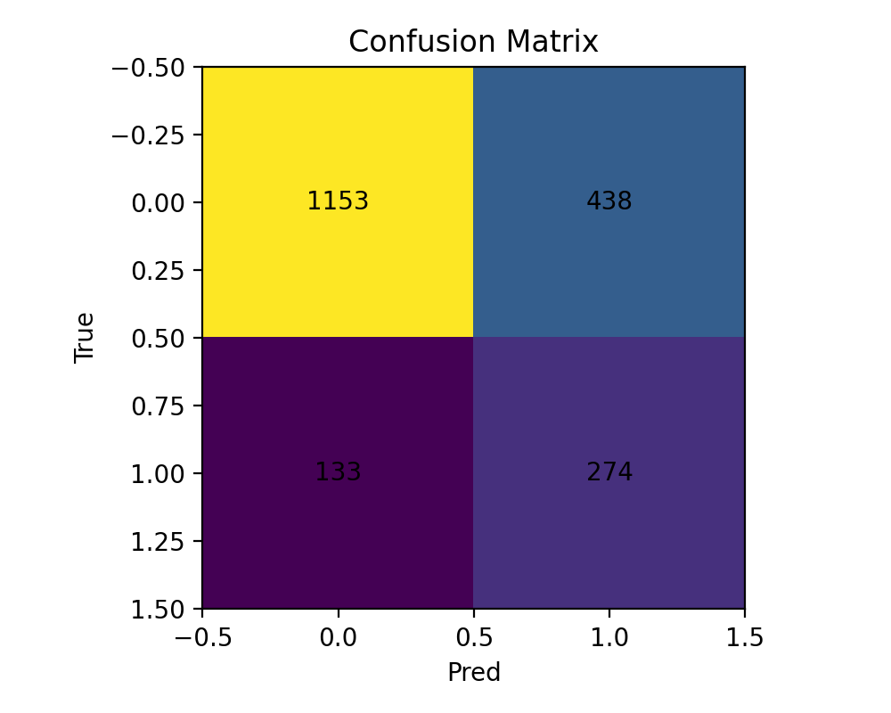

# SMOTE vs Class Weight Comparison

## Experiment Goal

Compare two methods for handling class imbalance and determine which gives better F1 score.

## Dataset Info

- Total samples: ~10,000
- Class 0 (Stayed): ~80%
- Class 1 (Exited): ~20%
- Imbalance ratio: 4:1

---

## Results

### Method 1: class_weight="balanced" (Baseline)

**Configuration:**

```yaml
model:
  class_weight: "balanced"
```

**Metrics:**

- Accuracy: 0.7102102102102102
- F1 Score: 0.49076517150395776

**Date:** 1/20/2026

---

### Method 2: SMOTE

**Configuration:**

```yaml
model:
  class_weight: null
```

- SMOTE applied after preprocessing to training data
- Balanced minority class from 1629 → 6361 samples

**Metrics:**

- Accuracy: 0.7142142142142142
- F1 Score: 0.4897229669347632

**Date:** 1/20/2026

**Class Distribution:**

- Before SMOTE: 0=6361, 1=1629 (imbalanced)
- After SMOTE: 0=6361, 1=6361 (balanced)

---

## 📊 Comparison Summary

| Method                  | Accuracy | F1 Score | Winner |
| ----------------------- | -------- | -------- | ------ |
| class_weight="balanced" | 0.7102   | 0.4908   | ✓      |
| SMOTE                   | 0.7142   | 0.4897   |        |

### Performance Difference:

- Accuracy change: +0.0040 (POSITIVE)
- F1 Score change: -0.0011 (NEGATIVE)

---

## 🎯 Conclusion

### Which Method Won?

**Winner: class_weight="balanced"** based on F1 score

### Analysis:

- ✅ class_weight is simpler and achieved better results
- ✅ No need for synthetic data generation
- ✅ Less computational overhead
- 📌 Recommendation: Keep using class_weight for this dataset

### Key Learnings:

1. F1 score is more important than accuracy for imbalanced data
2. class_weight="balanced" performed better for predicting customer churn
3. Both methods successfully handled class imbalance better than naive approach
4. The difference in F1 was 0.0011 points

### Trade-offs:

**class_weight:**

- ➕ Simpler implementation
- ➕ Faster training (no synthetic data generation)
- ➕ Original data unchanged
- ➖ Relies on model's internal weighting

**SMOTE:**

- ➕ Explicitly balances dataset
- ➕ Model sees more minority examples
- ➖ More complex preprocessing
- ➖ Longer training time
- ➖ Risk of overfitting to synthetic data

---

## 📈 Visual Comparison

### Confusion Matrices:

- **Baseline:**
  
- **SMOTE:**
  

**Recommendation:** Open both images side-by-side to see difference in predictions.

---

## ✅ Final Recommendation

For this Bank Customer Churn dataset:

- **Use class_weight="balanced"** for production deployment
- **Reason:** Better F1 score, simpler implementation, more efficient
- **Expected Performance:** ~49.08% F1 score

---

## 🔬 Future Experiments

To further improve:

1. Try different SMOTE variants (SMOTE-Tomek, SMOTE-ENN)
2. Experiment with different sampling ratios
3. Combine both methods (SMOTE + class_weight)
4. Try other algorithms (Random Forest, XGBoost)
5. Feature engineering to improve predictions
